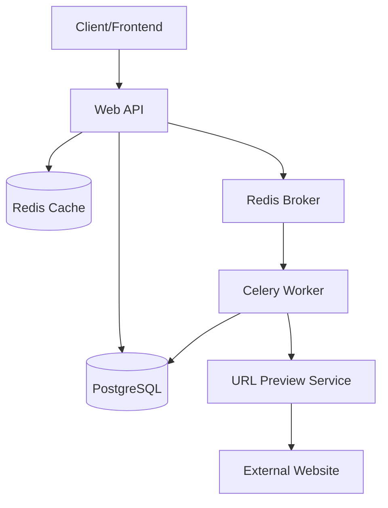

# Enterprise-Grade URL Shortener Microservice

This project is a highly scalable URL shortening service built with Django 5.0+, Django REST Framework, and a distributed microservices architecture.

## Architecture

The system consists of several components:
- **Main Web API (Django)**: Handles user accounts, URL management, and analytics.
- **URL Preview Service (Django)**: A separate microservice that fetches metadata (title, description, favicon) from target URLs.
- **PostgreSQL**: Primary relational database.
- **Redis**: Used for caching redirects and as a message broker for Celery.
- **Celery Worker**: Processes asynchronous tasks like click tracking and metadata fetching.
- **Celery Beat**: Handles periodic maintenance tasks.

### Architecture Diagram (Simplified)



## Getting Started

### Prerequisites
- Docker and Docker Compose

### Running the Project

1. **Clone the repository**
2. **Create a `.env` file** in the root directory:
   ```env
   SECRET_KEY=your-secret-key
   DB_NAME=url_shortener
   DB_USER=postgres
   DB_PASSWORD=postgres
   ```
3. **Build and start the containers**:
   ```bash
   docker-compose up --build
   ```
4. **Run migrations**:
   ```bash
   docker-compose exec web python manage.py migrate
   ```
5. **Access the API**:
   - Web API: `http://localhost:8000/api/v1/`
   - Swagger Documentation: `http://localhost:8000/api/v1/docs/`
   - Preview Service: `http://localhost:8001/api/preview/`

## API Endpoints

### Authentication
- `POST /api/v1/auth/register/` - Create a new account
- `POST /api/v1/auth/login/` - Login and get JWT tokens
- `POST /api/v1/auth/refresh/` - Refresh access token

### URL Operations
- `POST /api/v1/urls/` - Create a short link
- `GET /api/v1/urls/` - List user's URLs
- `GET /api/v1/urls/{short_code}/` - Get details of a specific URL
- `PUT /api/v1/urls/{short_code}/` - Update target URL
- `DELETE /api/v1/urls/{short_code}/` - Delete URL

### Redirection (Public)
- `GET /{short_code}/` - Redirects to original URL (triggers analytics)

### Analytics
- `GET /api/v1/analytics/{short_code}/` - Detailed stats (Premium users only)

## Module 9 Features: Microservices Essentials
- **Inter-Service Communication**: The main app calls the Preview Service using `httpx`.
- **Resiliency**: Implemented retries with exponential backoff for service calls using `tenacity`.
- **CORS Support**: Configured `django-cors-headers` to allow frontend integration.
- **Asynchronous Processing**: Metadata fetching is handled in the background by Celery.
